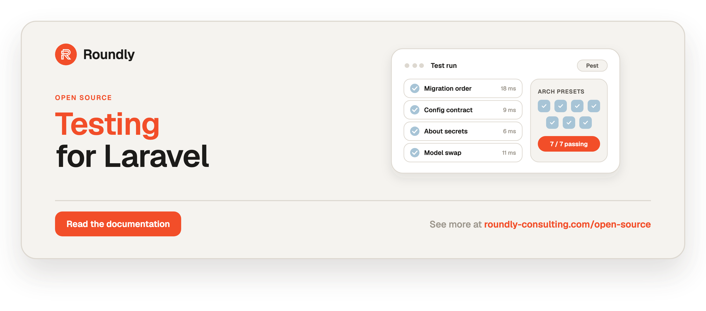

<!-- roundly-hero:start -->
<p align="center">
  <a href="https://roundly-consulting.com/open-source/docs/testing-for-laravel?utm_source=github&utm_medium=readme&utm_campaign=open-source&utm_content=testing-for-laravel">
    
  </a>
</p>
<!-- roundly-hero:end -->

<!-- roundly-badges:start -->
<p align="center">
  <a href="https://packagist.org/packages/roundly-consulting/testing-for-laravel"></a>
  <a href="https://github.com/roundly-consulting/testing-for-laravel/actions/workflows/run-tests.yml"></a>
  <a href="https://github.com/roundly-consulting/testing-for-laravel/actions/workflows/fix-php-code-style-issues.yml"></a>
  <a href="https://donate.stripe.com/dRmeVe8FX5PF1Qd9pXcEw00"></a>
</p>
<!-- roundly-badges:end -->

# Testing for Laravel

**The test suite that can't lie to you.** Dev-only test machinery for Laravel packages
and applications — base test cases, a structural migration-order pin, a real-engine
runner, a both-directions config contract, a secret-safe `about` capture, a model-swap proof, lock
recorders, a driver matrix, and seven architecture presets. Every assertion is built so it
**can always fail**: no vacuous green, no assertion that passes because it never really ran.

Each helper here exists because a real bug shipped past a test that *couldn't* fail —
a secret-leak check reading empty output, a config regex satisfied by a docblock, a
migration order green on SQLite but uninstallable on Postgres. So every assertion in this
package requires its positive proof, guards its own parse, and ships a "proves-it-bites"
self-test that goes red on a broken fixture.

## Requirements

- PHP 8.4+
- Laravel 12 or 13
- Pest 4 (the assertions ship as Pest expectations)

## Two audiences, by design

1. **Roundly `*-for-laravel` packages** — the Testbench-based `PackageTestCase` plus every
   expectation. This is the primary consumer; it replaces the near-identical
   `tests/TestCase.php` copied into every package.
2. **Whole Laravel apps** — a normal app's own suite can run the same assertions against
   its own migrations, config, and models, with **no roundly package and no Testbench
   installed**. The static `Assert`, the Pest expectations, and the arch presets never
   reference Testbench (enforced by this package's own arch test). See
   [For applications](#for-applications).

## Installation

```bash
composer require --dev roundly-consulting/testing-for-laravel
```

The Pest expectations register automatically through `extra.pest.plugins`. Suites that
disable plugin discovery register them explicitly in `tests/Pest.php`:

```php
<?php

declare(strict_types=1);

use RoundlyConsulting\Testing\Expectations\Expectations;

uses(RoundlyConsulting\Passkeys\Tests\TestCase::class)->in('Feature', 'Unit');

Expectations::register(); // idempotent — a no-op if the Pest plugin already ran
```

Both paths coexist: the plugin registers on boot, `Expectations::register()` guards on an
internal flag, so calling both is safe.

## The migration-order pin

```php
expect($migrationsDir)->toHaveRunnableMigrationOrder(?int $foreignKeys = null, array $tableResolvers = []);
```

Parses the foreign keys out of your migration **source** and asserts every referenced
table is created before the migration that references it — a *structural* check.

```php
it('has a runnable migration order', function (): void {
    expect(database_path('migrations'))->toHaveRunnableMigrationOrder(foreignKeys: 19);
});
```

**Bug it prevents:** five packages (approvals #2, messages #7, shops #17, teams #20,
reviews #36) shipped uninstallable migration orders under **green SQLite suites**, because
SQLite happily creates a table that points at a missing parent and only complains at
insert time. Teams #20 proved it three times over: of the three order checks, only the
structural one goes red on SQLite. It understands every FK form the fleet uses —
`->constrained('table')`, bare `->constrained()` (parent derived from the column, teams
#20), long-hand `->references('id')->on('table')` (alerts #34), and
`->constrained(Class::method())` via `tableResolvers` (permissions) — pins that a
`Schema::table()` ALTER sorts after its CREATE (approvals #2) and that a self-referencing
key sorts with its own migration (advertisements #33, reviews #36). An unparseable
declaration **fails** rather than being silently dropped, and `foreignKeys:` pins the edge
count so the check can never pass over an empty parse.

### Real-engine runner and its negative control

```php
expect($migrationsDir)->toApplyOnConnection(string $connection, ?int $migrations = null);
expect($migrationsDir)->toRejectBrokenOrderOnConnection(Closure $reorder, string $connection);
```

The structural pin is engine-independent; the definitive proof runs the migrations against
a live database.

```php
it('applies on postgres', function (): void {
    expect(database_path('migrations'))->toApplyOnConnection('pgsql', migrations: 14);
})->skip(fn (): bool => ! test()->connectionAvailable('pgsql'), 'no postgres');

it('rejects a broken order on postgres', function (): void {
    expect(database_path('migrations'))->toRejectBrokenOrderOnConnection(
        fn (array $files): array => array_reverse($files),
        'pgsql',
    );
})->skip(fn (): bool => ! test()->connectionAvailable('pgsql'), 'no postgres');
```

**Bug it prevents:** a green FK test proves nothing until you have watched the engine
*reject* the broken order (forms #28). `toRejectBrokenOrderOnConnection` is that negative
control — it passes only if the engine refuses the reordered set, and **fails loudly** if
the engine accepts it (a driver that does not enforce foreign keys, like SQLite, makes the
check vacuous).

`toApplyOnConnection` guards itself twice: optional `migrations:` pins the file count so the
check cannot pass over an empty or relocated directory, and a set that applies without
creating a single table **fails** — "the migrations applied cleanly" is true of an empty
`up()` and proves nothing. Pin the count wherever you adopt it.

`PackageTestCase` registers the `pgsql` connection (from `DriverMatrix`) and ships
`connectionAvailable()` — a mirror of `MigrationRunner::connectionIsAvailable()`, which is
what an app suite without the base case should gate on. Gate both assertions on it so a run
with no Postgres *skips visibly* instead of passing vacuously.

> **Check the skip count, not the colour.** These gates skip when the engine is unreachable,
> so a misconfigured CI leg reports green having asserted nothing. On a leg that exists to
> run them, their skip count must be **zero**.

### No `down()` — and why the pgsql leg still works

Roundly packages **migrate forward only**. The developer standard is explicit:

> **Never define a `down()` method** — packages migrate forward only; a rollback path is
> dead code that drifts out of sync with `up()`.

So there is no rollback pin here, and **nothing in this package asks you for a `down()`**.
That is a deliberate correction: an earlier `toRollBackCleanly` asserted the inverse of the
standard, went red across all 30 packages it was tried on, and was deleted. 94 of the fleet's
98 migration files ship no `down()` because they are *complying*.

**The failure that looked like it needed `down()`.** Turning this package's own pgsql leg
real surfaced 22–26 failures, every one a `relation "..." already exists`. The cause reads
like a missing `down()`, and isn't. Testbench's `loadMigrationsFrom()` resets state by
running `migrate:rollback` after each test; `Migrator::runMigration()` guards `down()` with
`method_exists`, so for a compliant package that rollback is a **silent no-op**. On SQLite
`:memory:` it never mattered — the database dies with the connection. On a real engine the
tables survive and the **next** test dies creating them again, naming an innocent migration.

**The fix is to stop asking for a rollback**, not to write 94 `down()`s.
[`PackageTestCase`](#packagetestcase) resets a real engine by **dropping every table and
re-migrating**, which restores the same state with zero `down()`. You get this for free by
extending the base case — there is nothing to configure:

```php
final class TestCase extends PackageTestCase
{
    protected function packageProviders(): array { return [WalletServiceProvider::class]; }
    protected function migrationSources(): array { return [WalletServiceProvider::class]; }
}
```

On SQLite `:memory:` the reset does nothing at all — the connection already is the reset —
so that path is untouched and costs nothing.

> **Why not `RefreshDatabase`?** It migrates once and wraps each test in a transaction. That
> adds a transaction level, and [the lock recorders](#lock-recorders) assert on
> `transactionDepth` — the datum that condemned the deleted `LockedUpdate` helper, whose lock
> landed in a savepoint released before the ledger write. A drop is pure DDL and opens no
> transaction, so a test observes its own depth and nothing else's. Drop-and-remigrate is the
> correct `down()`-free reset.

**Uninstalling** a package is the host app's business, and hosts do it by dropping the tables
the package documents — not by running a rollback path the package never tested. Forward-only
migrations are the supported shape.

## Publish-only migration guards *(package-only)*

```php
expect($providerClass)->toNotAutoLoadMigrations(?string $migrationsDir = null);
expect($providerClass)->toPublishMigrationsTimestamped(string $tag, int $count);
```

```php
expect(PasskeysServiceProvider::class)->toNotAutoLoadMigrations();
expect(PasskeysServiceProvider::class)->toPublishMigrationsTimestamped('passkeys-migrations', 3);
```

**Bug it prevents:** the fleet publishes migrations timestamped rather than auto-loading
them; doing both runs both copies — a duplicate-table failure (bug #5, on three packages).
These two expectations only make sense against a package service provider, so they are
**package-only** — an app has no provider to point them at.

## The config-key contract

```php
expect($configPath)->toSatisfyConfigContract(string|array $srcDirs, array $options = []);
```

Pins, in both directions, that a package ships exactly the config keys it reads. Reads are
scraped from **source tokens**, never a regex.

```php
expect(config_path('passkeys.php'))->toSatisfyConfigContract(__DIR__.'/../../src', [
    'excludeFromReverse' => ['PasskeysServiceProvider.php'], // renders keys; a render is not a read
    'sectionVariables'   => ['PasskeyConfig.php' => ['$rp' => 'passkeys.rp']], // DTO array-offset reads
]);
```

Reads are counted from `config('pkg.key')`, `Config::get('pkg.key')`, **an injected
`Illuminate\Contracts\Config\Repository`** (`$this->config->get('pkg.key')`, and the
`string()`/`integer()`/`boolean()`/`array()` family), and `sectionVariables` array offsets.
The repository binding is resolved from the **declared type**, so a `$cache->get('pkg.x')`
on a cache repository is correctly not a config read.

`sectionVariables` follows offsets to **any depth**: with `['$rl' => 'pkg.rate_limiters']`,
`$rl['public']['enabled']` counts as a read of `pkg.rate_limiters.public.enabled`. It maps a
local (`$rl`) or a property (`'$this->config'`) alike.

Both directions are reported **together**. They are independent halves computed from one
read-set, and the forward half used to throw first — on `kubernetes-api` that masked 39 unread
keys until the forward failure was fixed and the suite re-run.

### What gets scanned — and why a REVERSE finding is not proof of a dead key

Each `$srcDirs` entry is scanned, **plus its sibling `database/` and `routes/`** when they
exist (migrations, factories, and route files all read config). Nothing else.

**That scope is finite, so a REVERSE finding means "no reader *in the scanned directories*" —
never "no reader anywhere".** A key read from a Blade view, from a directory you did not pass,
or from the host app scrapes as unread and is reported identically to a genuinely dead one. The
failure message therefore **prints the directories it searched**; read that list before acting
on a finding.

This is a real gap, documented rather than papered over. It has bitten: `git.webhooks.middleware`
was reported as a key "nothing reads" while `routes/git-webhooks.php` read it — deleting it as
the report advised would have unregistered the webhook route's middleware. `routes/` is scanned
by default now, but the general shape remains for any reader outside the scope.

**If a finding names a key you can see a reader for, the scope is wrong — not the key.** Add the
reader's directory:

```php
expect(config_path('media.php'))->toSatisfyConfigContract([
    __DIR__.'/../../src',
    __DIR__.'/../../resources/views',   // a directory the default scope misses
]);
```

Reach for `allowUnread` only when the key is genuinely unread **or** unmappable by the scraper —
never to silence a key you know is read from an unscanned directory. `allowUnread` asserts the
key is not read; on a key that *is* read, that entry is simply false, and it blinds the direction
for real. Both allow-lists are rot-checked: an entry that silences nothing fails.

### Driver-keyed sections

A section keyed by a runtime driver name — Laravel's own `database.connections.<name>` shape —
is read by interpolating that name, and is checked:

```php
config("git.providers.{$key}.url")   // scraped as: git.providers.*.url
```

The `*` is derived from the **source tokens**, not declared by you: the driver is a runtime
value, but the leaf (`url`) is a literal sitting right there, and that leaf is what gets
proven. So every shipped `providers.<driver>.url` counts as read — and a shipped
`providers.<driver>.timeout` that no read names still goes **red**. This is why the wildcard is
not `allowUnread` wearing a hat: a dead *leaf* still bites.

When the read stops *at* the hole, it is a wholesale section read — the same verdict the
literal `config('git.providers')` has always got: covered forward, proving no leaf. Map the
local to prove the leaves, with a `*` for the driver:

```php
$http = config("git.providers.{$this->key()}", []);   // wholesale: proves no leaf
$http['timeout'];                                     // proves git.providers.*.timeout, once mapped

'sectionVariables' => ['BaseProvider.php' => ['$http' => 'git.providers.*']],
```

A wildcard base path is a claim about which section the variable holds, and the **forward
direction checks that claim** — a base matching nothing shipped (`git.provider.*`, a typo)
fails rather than silently proving leaves that do not exist.

**Known gap, stated rather than papered over:** a pattern proves the *leaf*, never the
*driver*. `providers.bitbucket.url` counts as read once any driver's `url` is read. That axis
is unprovable from config reads — the host picks the driver at runtime, and shipping config for
a driver it never selects is correct, not dead. A driver stanza no factory can build is a real
defect, but a *registry* one; this contract does not claim to catch it.

**Bugs it prevents:**
- **Forward** (every key the code reads is shipped) — shops #18: the whole store-credit
  feature read `shops.payments.*` while the file shipped `payment.*`, so
  `SHOPS_ALLOW_STORE_CREDIT` did nothing and 330 tests stayed green because the suite set
  the same wrong key.
- **Reverse** (every shipped leaf is read) — alerts #24 (a thrice-documented `escalation`
  key nothing read), media #27 (a `max_file_size` cap that never applied — an upload
  endpoint with *no size limit*), query-builder #32, permissions' dead `load_migrations`.
- **Tokenizer, not regex** — media #27's near-miss: a regex over raw text was satisfied by
  a *docblock mention* and stayed green with the fix reverted. A docblock is a comment
  token here, never a read.

A key that resolves to no checkable pattern is **flagged**, never silently ignored — and there
is deliberately **no allow-list** for it: that check runs before the forward and reverse checks
and consults neither, so the only remedies are a literal key, a driver-keyed read that names its
leaf, or a `sectionVariables` offset read. Two shapes qualify: a hole that doesn't fill a whole
segment (`config("pkg.drivers.{$name}x")`), and a key not built from literals and holes at all
(`config($this->keyFor('x'))`). So does `config("pkg.{$x}")` — a hole directly under the root
strips to a bare prefix that no forward check could test, so the most opaque shape keeps its
pressure to name a literal.

`allowUnread`/`allowUnshipped` are rot-proof (a stale entry that silences nothing is itself
a failure); `reverse => false` is the forward-only mode for apps.

**`extraReadPrefixes` counts a matching literal wherever it appears** — including where it is
not a config key at all. `kubernetes.` is the Kubernetes API's own namespace, so an annotation
literal `kubernetes.io/tls` scraped as a config read; a routes filename (`purchases.php`) and a
route-name default (`alerts.health`) did the same. None is distinguishable from a real key by
shape, so filtering them would be a guess. Instead a forward finding names the literal, the file
it came from, and that the prefix is why it counted:

```
FORWARD — the code reads 'purchases.' keys that the config file does not ship:
  - purchases.php  [read in PurchasesServiceProvider.php (counted because it matches extraReadPrefixes)]
```

Name keys exactly rather than blanket-prefixing.

## The secret-safe `about` capture

```php
expect($section)->toLeakNoSecrets(array $secrets, array $mustRender);
```

```php
expect('passkeys')->toLeakNoSecrets(
    secrets: ['auth.acme-internal.example', '/srv/acme/secrets', 'ea9b8d66'],
    mustRender: ['Sign-count policy', 'AAGUID allow-list'],
);
```

**Bug it prevents:** purchases #13 — the fleet's most credential-heavy `about` section was
guarded by a negative assertion against `app(Kernel::class)->output()`, which returns `''`.
Every "does not leak" check was vacuous; the leak was caught only because one positive
assertion happened to exist. This capture goes through `Artisan::call('about', …)` +
`Artisan::output()` and runs in order: (1) output non-empty, (2) every `$mustRender` string
present, (3) only then no secret renders. `$mustRender` is required and non-empty — an
empty list throws at call time, because a negative-only check can pass against empty output.

## The model-swap proof

```php
expect($configKey)->toHonourModelSwap(string $subclass, Closure $exercise, bool $expectsCreation = true);
```

The host subclass **must** use the shipped `CountsCreations` trait:

```php
class CustomMedia extends Media
{
    use CountsCreations;
}

// config('media.media_model') swapped to CustomMedia::class before boot
expect('media.media_model')->toHonourModelSwap(CustomMedia::class, function () use ($user, $path) {
    $media = $user->addMediaFromPath($path, 'avatar'); // the real flow, not a resolver string check
    return [$media, $user->firstMedia('avatar')];
});
```

**Bug it prevents:** the retrofit's single biggest class (12+ entries) — implicit `hasMany`
FKs derived from the parent class name, bare `belongsToMany()` deriving the pivot,
`static::query()` in a `findOrCreate` helper (permissions #31/#34), hard-coded call sites
beside an honoured config (shops #3, media #28), and `final` on the invited subclass (7×).
It fails fast if `config($configKey) !== $subclass` (you forgot the before-boot swap), then
asserts every returned model's **concrete class** is `$subclass` — `instanceof` is not
enough, because a row created as the packaged class never fires the host's model events —
and finally that a `created` event landed on `$subclass` itself, the only proof the row was
really created *as* the host class (#31).

`CountsCreations` is **required**, not detected. It used to be opt-in, and omitting it
dropped the created-event half in silence — 15 assertions quietly became 13, so a caller who
had never thought about the trait got a weaker proof under the same name (`alerts`'
seam-bypass proof stayed green until the trait was added). A missing trait now fails with
instructions. For a flow that genuinely creates no row, say so explicitly:

```php
expect('media.media_model')->toHonourModelSwap(
    CustomMedia::class,
    fn () => $user->firstMedia('avatar'),   // reads an existing row, creates nothing
    expectsCreation: false,
);
```

## Architecture presets

Seven composable presets, each grounded in a bug the fleet shipped. Call one at the top of
a Pest arch file; it registers its own case.

```php
use RoundlyConsulting\Testing\Arch\ArchPresets;

ArchPresets::strictTypes(string $namespace, array $ignoring = []);
ArchPresets::finalByDefault(string $namespace, array $ignoring = []);
ArchPresets::swappableModelsAreNotFinal(array $map);               // [Shop::class => 'shops.shop_model']
ArchPresets::noLocalCryptoPrimitives(string $namespace, array $ignoring = []);
ArchPresets::modelsResolveThroughSeam(string $srcDir, string $seamDir = 'Support', array $modelKeys = []);
ArchPresets::runtimeRequireIsWhitelisted(string $composerJson, array $alsoAllow = []);
ArchPresets::noDebuggingLeftovers(array $ignoring = [], ?string $srcDir = null); // dd/dump/ray/var_dump/print_r
ArchPresets::shadowedClassesAreFinal(string $namespace, array $exemptions); // only if you use ->ignoring()
ArchPresets::exemptionsExist(array $exemptions, string $for); // the pin the presets register for you
```

### Exempt through the `$ignoring` **parameter**, not `->ignoring()`

**Every preset takes an `$ignoring` parameter. Use it.** Entries passed that way are checked:
a name that silences nothing — a typo, or an exemption that outlived the class it excused —
**fails**, because a hole shaped like coverage is worse than no coverage.

```php
ArchPresets::finalByDefault('RoundlyConsulting\Shops\Actions', [SomeBase::class]);
ArchPresets::noLocalCryptoPrimitives('RoundlyConsulting\Passkeys', ['RoundlyConsulting\Passkeys\Attestation']);
```

**As many lists per file as you have presets.** Each preset pins its own list under its own
description, so two (or five) exemption lists coexist:

```php
ArchPresets::finalByDefault('RoundlyConsulting\Shops', [ShopException::class]);
ArchPresets::noDebuggingLeftovers([Resource::class]); // a second list — fine
```

Calling `exemptionsExist()` directly (for a bespoke rule of your own) is the one place you
name the rule yourself — `$for` is what a developer reads when the pin fires, and it is what
keeps two pins in one file distinct:

```php
ArchPresets::exemptionsExist($ignoring, 'no facades outside the facade layer');
```

The three presets built on Pest's arch layer (`strictTypes`, `finalByDefault`,
`noLocalCryptoPrimitives`) return the underlying arch expectation, so Pest's fluent
`->ignoring(...)` still composes on them — **but it is not checked, and this README used to
teach it.** The two forms are not equivalent:

```php
// Checked: a stale or misspelled entry FAILS.
ArchPresets::finalByDefault('RoundlyConsulting\Shops\Actions', ['RoundlyConsulting\Nope']);

// NOT checked: the identical bogus entry passes green, silently.
ArchPresets::finalByDefault('RoundlyConsulting\Shops\Actions')->ignoring('RoundlyConsulting\Nope');
```

This gap is **stated rather than fixed**, because the honest fix isn't available: `->ignoring()`
is Pest's own method on an `@internal` object whose `__destruct()` is what evaluates the
expectation. Wrapping it to intercept the call would put this package between Pest and that
destructor — and an arch case that silently stops running is precisely the failure this whole
package exists to end. A documented gap beats a check that lies. Pass the parameter.

Note also that `->ignoring()` and `$ignoring` alike are scoped to a **class**, not a function:
exempting a class to permit one call relaxes the *whole* ban for that class. Scope it to the
smallest class that genuinely needs it.

### Exemptions match by **prefix**, so they silence more than they name

Pest excludes an object when `str_starts_with($object->name, $exclude)` — a **string prefix**
test, not class identity (`pest-plugin-arch/src/Blueprint.php:103`). Exempting one class
therefore silently exempts every class whose fully-qualified name starts with the same
characters:

```php
ArchPresets::finalByDefault('RoundlyConsulting\Purchases', [Stripe::class]);
// ...also silences StripeClient. Delete its `final` and the suite stays GREEN.
```

This was found by biting the preset: `StripeClient` was un-finalled on purpose and
`finalByDefault` never blinked. It is the rot check above inverted — that one catches an
exemption that silences *nothing*; this catches one that silences *too much*, and it is the
quieter of the two, because the suite stays green and the exemption list still reads correct.

**`finalByDefault` closes this for you** when you pass `$ignoring`: it re-checks, by
reflection, every class your exemptions silence without naming. A shadowed class that is
already final stays green — no declaration, no ceremony. One that is not goes **red**, naming
the class and the exemption that hid it:

```
These classes are not final, and `finalByDefault` cannot see them:
  - RoundlyConsulting\Metrics\MetricsManager (hidden by the exemption RoundlyConsulting\Metrics\Metrics)
```

If a shadowed class is genuinely meant to stay open, **name it in `$ignoring`**. It is then an
explicit, reviewable, rot-checked decision rather than a side effect of its neighbour.

Matching is on the **fully-qualified** name, so this only reaches classes sharing a namespace
*and* a name prefix — `Models\Role` cannot shadow `Database\Factories\RoleFactory`. A
**namespace** exemption is left alone: excluding a subtree is a deliberate, documented use of
`->ignoring()`, and the intent is read from the exemption itself (name a class, you meant that
class; name a namespace, you meant the subtree).

This recovery rides on the `$ignoring` **parameter** — a second, sharper reason to prefer it.
The fluent form is not merely unchecked; it silently forfeits this too. If you must use it,
bind the list once and pass the same variable to both:

```php
$ignoring = [Github::class, Batch::class];

ArchPresets::finalByDefault('RoundlyConsulting\Git')->ignoring($ignoring);
ArchPresets::shadowedClassesAreFinal('RoundlyConsulting\Git', $ignoring); // fluent form only
```

**`modelsResolveThroughSeam`: declare `$modelKeys` unless every swap key you own is named
`model`, `models`, or `*_model`.** Undeclared, its stray-literal half infers swap keys from
key *shape*, so it polices only the keys named that way. That inference is complete for most
packages and silently incomplete for the rest — `alerts` swaps four models, but only
`alerts.history.model` is conventionally shaped, so a stray `config('alerts.alert')` outside
the seam left the preset **green**, covering one seam of four while looking authoritative.
Widening the pattern can't fix it (`alerts.silence` is a boolean and `alerts.alert` a model —
same shape), so name the keys instead. It's the list you already pass to
`swappableModelsAreNotFinal`, and declared keys are *unioned* with the inferred ones, so
declaring can only add coverage. A declared key that matches no literal in your source fails
rather than pretending to cover something:

The late-static-binding half fires only in a **static context**, where the called class is
whatever the caller named. `self::` and `static::` are *forwarding* calls, so inside an
**instance** method late static binding survives them and `self::query()` already builds for
`$this`'s runtime class — the configured one. A `prunable()` that does so is correct, and
routing it "through the seam" would introduce a bug, pruning a host's un-configured subclass as
the packaged base class. The ban is also gated on the class actually extending `Model`: in a
plain class, `query()` is just a static helper of its own and `new static` is the ordinary
named-constructor idiom.

```php
ArchPresets::modelsResolveThroughSeam(__DIR__.'/../src', 'Support', [
    'alerts.alert', 'alerts.health-check', 'alerts.silence-model', 'alerts.history.model',
]);
```

The four Pest's arch layer can't express (`swappableModelsAreNotFinal`,
`modelsResolveThroughSeam`, `runtimeRequireIsWhitelisted`, `noDebuggingLeftovers`) register
a token/reflection `it()` case instead. Those have **no** fluent `->ignoring()` at all — the
`$ignoring` parameter is the only way in, which is also why it is the form to learn:

```php
ArchPresets::noDebuggingLeftovers(['RoundlyConsulting\Shops\Debug\Inspector']);
```

`noDebuggingLeftovers` scans `<cwd>/src` by default; pass `$srcDir` to scan elsewhere. It
reads **source tokens** rather than Pest's arch layer for a specific reason: the arch layer
only sees a dependency whose symbol *exists*, and the `ray()` debugger package is not in the dependency
graph by policy — so `ray` was filtered out before the ban ran and **could never fail**,
while the other four bit normally. The one debug tool you'd realistically leave behind was
the exact one the preset couldn't catch. Tokens don't care whether the function exists.

**Bugs each prevents:**

| Preset | Bug it prevents |
|---|---|
| `strictTypes` | files drifting off `declare(strict_types=1)`, so a silent type coercion slips in |
| `finalByDefault` | accidental extension points; classes meant to be closed left open |
| `swappableModelsAreNotFinal` | `final` on a config-swappable model — a PHP fatal the moment a host swaps it, shipped **7×** (shops #19, teams #21, advertisements #23, alerts #25, reports #33, posts #35, passkeys #37) |
| `noLocalCryptoPrimitives` | crypto primitives (`hash`, `hash_hmac`, `openssl_*`, `sodium_*`, `random_bytes`, `base64_*`) re-implemented locally instead of in `crypto-for-laravel` (passkeys ban list). `hash_equals` is **not** banned — it *is* PHP's constant-time compare, not a copy of one, and banning it pushed callers toward `$a === $b`, a timing leak (see `CRYPTO_PRIMITIVES`) |
| `modelsResolveThroughSeam` | `static::query()`/`self::query()`/`new static` **in a static context** resolving the *called* class, not the *configured* one — it broke authorization (permissions #34); also a swap literal read outside the seam — declare `$modelKeys` if your keys aren't `*_model` shaped |
| `runtimeRequireIsWhitelisted` | a third-party vendor slipping into `require` and shipping transitively into every consumer (the dependency policy as a test) |
| `noDebuggingLeftovers` | a stray `dd`/`dump`/`ray` shipped to production |

### The deliberate tension: `finalByDefault` vs `swappableModelsAreNotFinal`

These two presets pull in opposite directions **on purpose**. `finalByDefault` wants every
class final; `swappableModelsAreNotFinal` forbids `final` on a config-swappable model. The
fleet shipped `final` on a swappable model seven times under a green "everything is final"
arch test — a documented seam that was a PHP fatal error. Run **both**: exempt the swappable
models from the first (through the checked `$ignoring` parameter), pin them with the second.

```php
ArchPresets::finalByDefault('RoundlyConsulting\Shops', [Shop::class]);
ArchPresets::swappableModelsAreNotFinal([Shop::class => 'shops.shop_model']);
```

`swappableModelsAreNotFinal` asserts each mapped model is non-final **and** that the config
key defaults to that very model. The same check is available per-model as an expectation:

```php
expect(Shop::class)->toBeSwappableVia('shops.shop_model');
```

## The package base test case *(package-only)*

`PackageTestCase` replaces the near-identical `tests/TestCase.php` copied into every roundly
package. It runs against in-memory SQLite with foreign-key constraints **on**, loads
migrations **by provider class** (never by filename — the `LoadsProviderMigrations` concern
resolves each provider to its `database/migrations` by reflection), and applies config and
model swaps before the providers boot.

```php
use RoundlyConsulting\Testing\PackageTestCase;

final class TestCase extends PackageTestCase
{
    protected function packageProviders(): array
    {
        return [CryptoServiceProvider::class, PasskeysServiceProvider::class];
    }

    protected function migrationSources(): array
    {
        return [PasskeysServiceProvider::class];
    }

    protected function configBeforeBoot(): array
    {
        return ['passkeys.rp.id' => 'example.test'];
    }
}
```

Swap a configured model before boot with
`$this->swapModel('media.media_model', CustomMedia::class)` in `defineEnvironment()` — the
only correct place, since providers hang observers on the *configured* class at boot.

`PackageTestCase`, `LoadsProviderMigrations`, `toNotAutoLoadMigrations`, and
`toPublishMigrationsTimestamped` are **package-only**: they assume a package service provider
and Testbench. Everything else works Testbench-free in any app.

## Lock recorders and the driver matrix

SQLite compiles `lockForUpdate()` to an **empty string**, so a test cannot tell a locked
read from an unlocked one. Two observable variants ship, both recording the lock and the
**transaction depth** it ran at into `RoundlyConsulting\Testing\Fixtures\LockRecorder`:

```php
use RoundlyConsulting\Testing\Fixtures\Concerns\RecordsLocks;
use RoundlyConsulting\Testing\Fixtures\LockRecorder;

// Variant A — model is subclassable:
final class RecordingCoupon extends Coupon { use RecordsLocks; }

LockRecorder::flush();
DB::transaction(fn () => RecordingCoupon::query()->lockForUpdate()->get());
expect(LockRecorder::recorded()[0]['transactionDepth'])->toBe(1); // depth killed LockedUpdate
```

Variant B installs `LockRecordingGrammar`, which compiles the lock to a trailing
`/* lock-for-update */` SQL comment observed via `DB::listen()` — for when the model is not
subclassable. **Bug they prevent:** the alerts #26 races (an alert that never opened; a tier
paged twice) and the shops oversell, all invisible on SQLite otherwise.

`DriverMatrix` runs a suite across drivers so a SQLite-only run doesn't miss what the engines
disagree on — **translatable #39**: a `LIKE` without `ESCAPE` is green on Postgres and
returns zero rows on SQLite.

```php
use RoundlyConsulting\Testing\Database\DriverMatrix;

it('uses jsonb')->skip(fn () => DriverMatrix::driver() !== 'pgsql');
```

`PackageTestCase` calls `DriverMatrix::configure()` for you — call it yourself only in a
TestCase that does not extend the base case. `configure()` points the default `testing`
connection at `TESTING_DB_DRIVER` (default: in-memory SQLite, foreign keys on) and registers
`pgsql` and `mysql` as named connections, present-but-unreachable off a driver leg, so a
gated assertion skips *visibly* rather than never firing.

**A CI leg must export `TESTING_DB_DRIVER`.** The location vars
(`TESTING_DB_{HOST,PORT,DATABASE,USERNAME,PASSWORD}`) only say *where* the engine is;
exporting them without the driver leaves the whole suite on SQLite — a "pgsql" job that
never touches Postgres. See `.github/workflows/run-tests.yml` for the job to lift.

**Postgres has no `:memory:`.** Testbench migrates up per test and rolls back on teardown;
SQLite never needed that rollback because the in-memory database dies with the connection.
On a real engine the rollback would be the only thing resetting state — and `Migrator` skips
`down()` when the method does not exist, *silently*, which is every roundly migration by
standard. `PackageTestCase` therefore [resets a real engine by dropping every table and
re-migrating](#no-down--and-why-the-pgsql-leg-still-works) instead of asking for a rollback.
Extend the base case and a driver leg just works; write your own TestCase and this is the one
thing you must reproduce.

## For applications

A plain Laravel app — **no roundly package, no Testbench, no base-class change** — gets the
app-usable subset through the static `Assert` or the Pest expectations directly:

```php
use RoundlyConsulting\Testing\Assert;

it('has a runnable migration order', function (): void {
    expect(database_path('migrations'))->toHaveRunnableMigrationOrder();
});

it('reads every services key it relies on from the shipped config', function (): void {
    // Forward-only: an app's config legitimately carries keys read by vendor packages.
    expect(config_path('services.php'))->toSatisfyConfigContract(app_path(), ['reverse' => false]);
});

it('does not leak credentials through artisan about', function (): void {
    expect('environment')->toLeakNoSecrets(
        secrets: [config('services.stripe.secret')],
        mustRender: ['Application Name'],
    );
});
```

Applicable to apps: the migration order (+ real-engine runner + negative control), the
forward config contract (reverse opt-in), the `about` secret
capture, the model-swap proof
(apps consume config-swappable vendor models too), the lock recorders, `DriverMatrix`, and
every arch preset except `runtimeRequireIsWhitelisted` (roundly-specific whitelist — but
`alsoAllow` makes even that usable). Every assertion also has a static `Assert::…()` mirror
for plain-PHPUnit suites.

## Testing

```bash
composer test
```

<!-- roundly-support:start -->
## Support our work

This package is free and open source, built and maintained by
[Roundly Consulting](https://roundly-consulting.com/open-source?utm_source=github&utm_medium=readme&utm_campaign=open-source&utm_content=testing-for-laravel).
If it saves you time, please consider supporting our open-source work — every donation helps fund
maintenance, new features and new packages.

<a href="https://donate.stripe.com/dRmeVe8FX5PF1Qd9pXcEw00"></a>
<!-- roundly-support:end -->

## License

MIT. See [LICENSE.md](LICENSE.md).
